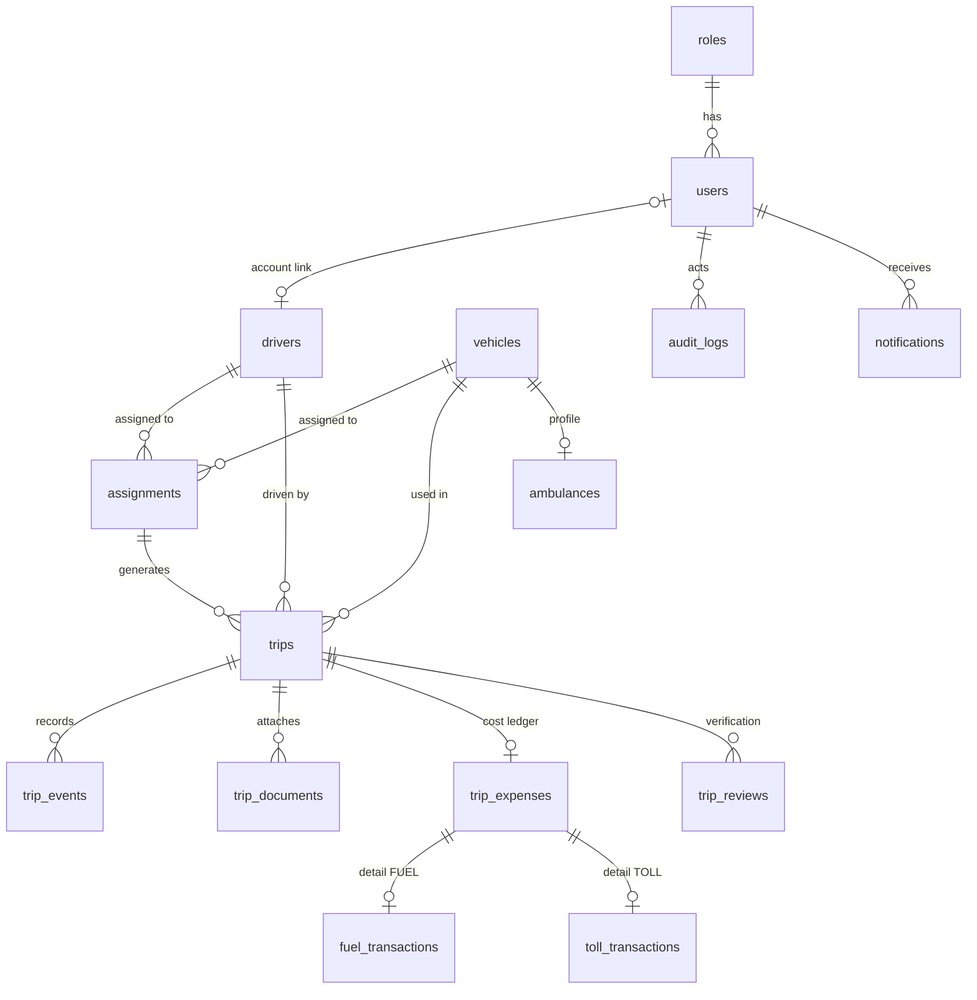

# PHASE 0 — SYSTEM BLUEPRINT

**Fleet Logbook & Monitoring System — Kendaraan Dinas & Ambulans**

| | |
|---|---|
| Dokumen | Phase 0 (PROJECT PLAN) — READ-ONLY, tanpa implementasi fitur |
| Versi | 0.1-draft |
| Tanggal | 25 September 2026 |
| Status | **MENUNGGU APPROVAL** |
| Stack | Native PHP 8.2 · MySQL/MariaDB · Bootstrap 5 · PDO · Vanilla JS ES6 |
| Catatan lokasi | Pada environment ini project dibangun di repo `monev-kendaraan` (setara `Z:\sias\kendaraan-app-v2\` pada XAMPP). Aplikasi lama TIDAK disentuh dan TIDAK dicopy. |

> **Aturan Phase 0:** Dokumen ini berisi arsitektur, desain, dan rencana SAJA. Tidak ada kode aplikasi, tabel database, atau endpoint yang diimplementasikan sebelum approval diberikan.

---

## DAFTAR ISI

1. Product Overview
2. User Roles
3. User Journey
4. Architecture (Module & Layer)
5. Database ERD
6. Trip Lifecycle (State Machine)
7. Authentication Architecture
8. GPS Architecture
9. Evidence Architecture
10. OCR Architecture
11. Expense Architecture
12. Reporting Architecture
13. Security Architecture
14. Mobile UX Architecture
15. API Architecture
16. Folder Structure
17. Design System Ringkas
18. Development Phases
19. Testing Strategy
20. Deployment Strategy
21. Acceptance Criteria
22. Risk Register

---

# 1. PRODUCT OVERVIEW

## 1.1 Apa ini

**Digital Journey & Vehicle Operational Logbook** untuk mencatat perjalanan **aktual** kendaraan dinas dan ambulans — bukan aplikasi booking, bukan sekadar CRUD kendaraan, bukan sekadar dashboard.

Alur inti:

```text
PENUGASAN → TRIP → START → PERJALANAN → ARRIVAL → BUKTI LOKASI
→ KEMBALI → END → BBM / E-TOLL / BIAYA → ST / SPPD
→ VERIFIKASI → PELAPORAN → EVALUASI
```

## 1.2 Sasaran produk

- **Ketepatan catatan:** setiap perjalanan tercatat dengan waktu server, GPS, foto, dan odometer.
- **Mobilitas driver:** seluruh aktivitas utama driver selesai di HP (mobile-first).
- **Kontrol operator/admin:** verifikasi bukti, monitoring live, laporan biaya.
- **Evaluasi:** cost/km, utilisasi kendaraan & driver, kesiapan ambulans.

## 1.3 Non-goal (di luar scope)

- Booking / reservasi kendaraan
- Integrasi telematics/OBD GPS hardware (arsitektur membolehkan penambahan nanti)
- Payroll, absensi umum, ERM rumah sakit
- Microservices, Docker, Redis, queue-broker — tidak diperlukan untuk skala internal RS

## 1.4 Prinsip desain

| Prinsip | Implementasi |
|---|---|
| Simple | Native PHP, 1 file = 1 tanggung jawab, tanpa framework |
| Secure | Server-side validation, CSRF, private storage, audit trail |
| Maintainable | Separation of concerns: config/core/models/modules/api |
| Mobile-first | Dirancang untuk layar 360px dulu, desktop menyusul |
| Honest data | GPS ≠ bukti absolut; OCR ≠ sumber kebenaran; waktu server menang |

---

# 2. USER ROLES

Role disimpan di tabel `roles` (**bukan ENUM**) sehingga dapat dikonfigurasi tanpa migrasi struktural.

| Role | Slug | Akses inti |
|---|---|---|
| Admin | `admin` | Master data (users, drivers, vehicles, ambulances), penugasan, verifikasi, laporan, konfigurasi, audit log |
| Petugas/Operator | `operator` | Penugasan, monitoring, logbook, dokumen, verifikasi (tergantung delegasi) |
| Driver | `driver` | Penugasan saya, trip lifecycle, GPS/foto, BBM/e-toll/biaya, upload dokumen, submit |
| Pimpinan/Monitor | `pimpinan` | Dashboard, monitoring, laporan, statistik, evaluasi — **read-only** |

Aturan:

- Setiap endpoint/memiliki guard otorisasi berdasarkan **permission ringkas per role** (daftar di `roles.permissions` sebagai JSON/relasi sederhana) — bukan hard-code `if ($role === 'admin')` di mana-mana.
- Driver hanya melihat **trip miliknya sendiri** (IDOR protection).
- Role baru (mis. `keuangan`) dapat ditambahkan lewat tabel roles + penyesuaian permission map.

---

# 3. USER JOURNEY

## 3.1 Driver (mobile-first — journey utama)

```text
LOGIN (username/password)
  ↓
BERANDA: "Selamat pagi, [NAMA]" + Kartu PERJALANAN AKTIF + Penugasan Berikutnya
  ↓
Buka penugasan  →  detail: tujuan, ST/SPPD, kendaraan, radius tujuan
  ↓
[ MULAI PERJALANAN ]  → izin GPS → foto opsional → isi KM awal
  ↓  (event START: server time + GPS + odometer tersimpan)
PERJALANAN AKTIF (kartu: start time, KM awal, GPS ✓, progress)
  ↓
[ SAYA SUDAH TIBA ]  → GPS + foto wajib → validasi jarak ke tujuan
  ↓  (event ARRIVAL: evidence tersimpan, hasil VALID/WARNING/REVIEW)
[ LANJUT PERJALANAN ] (kembali)  → optional GPS check
  ↓
[ AKHIRI PERJALANAN ] → isi KM akhir (≥ KM awal)
  ↓  (event END: total_distance dihitung server)
POST-TRIP WIZARD:
  1. Perjalanan ✓ → 2. BBM (foto struk → OCR → review → confirm)
  → 3. E-Toll → 4. Biaya lain → 5. Dokumen (ST/SPPD) → 6. Review
  ↓
[ SIMPAN DRAFT ] atau [ SUBMIT LOGBOOK ]
  ↓
status SUBMITTED → menunggu verifikasi
  ↓ (jika REVISION_REQUIRED → notifikasi → perbaiki → resubmit)
status VERIFIED ✓
```

## 3.2 Admin / Operator (desktop, tetap responsive)

```text
LOGIN
  ↓
DASHBOARD: total kendaraan/driver, trip hari ini, trip aktif, KM, BBM, e-toll, biaya
  ↓
MONITORING: daftar trip aktif (driver, kendaraan, tujuan, durasi, status GPS)
  ↓ → detail trip: timeline START → ARRIVAL → END, map rute, evidence, expense
  ↓
VERIFIKASI: review logbook (KM, bukti GPS/foto, struk, ST/SPPD)
  ↓ → APPROVE / REQUEST REVISION (dengan komentar) → audit trail
  ↓
MASTER DATA: kendaraan, ambulans, driver, users, role, konfigurasi
  ↓
LAPORAN: filter → lihat → export CSV/Excel/PDF
```

## 3.3 Pimpinan

```text
LOGIN → DASHBOARD (statistik & tren) → MONITORING read-only → LAPORAN & EVALUASI
```

Tidak ada tombol create/update/delete pada data operasional.

## 3.4 Skenario lintas-role

- Operator membuat penugasan → driver menerima notifikasi di beranda → driver menjalankan → operator monitoring live → admin verifikasi → pimpinan melihat laporan bulanan.
- Driver menolak/terhalang (GPS mati, kendaraan maintenance) → admin membatalkan penugasan (`CANCELLED`) atau menugaskan ulang.

---

# 4. ARCHITECTURE (MODULE & LAYER)

## 4.1 Layer

```text
┌─────────────────────────────────────────────────────────┐
│  PRESENTATION                                            │
│  public/*.php (view scripts)  ·  modules/*/views        │
│  assets: Bootstrap 5 + custom design system + vanilla JS │
├─────────────────────────────────────────────────────────┤
│  WEB CONTROLLERS                                         │
│  public/index.php (front controller) + routers per module│
│  → middleware: auth, role, CSRF, rate-limit              │
├─────────────────────────────────────────────────────────┤
│  API LAYER (JSON)                                        │
│  /api/* — konsisten {success, message, data|errors}      │
│  dipakai AJAX fetch dari UI & future mobile app          │
├─────────────────────────────────────────────────────────┤
│  APPLICATION SERVICES                                    │
│  services/: TripService, GpsService, EvidenceService,    │
│  OcrService, ExpenseService, ReportService, AuditService │
├─────────────────────────────────────────────────────────┤
│  DOMAIN + VALIDATORS                                     │
│  Trip state machine · Haversine · validators/*           │
├─────────────────────────────────────────────────────────┤
│  DATA ACCESS                                             │
│  models/* → PDO prepared statements · Query Builder mini │
│  transaksi & row-lock untuk start trip                   │
├─────────────────────────────────────────────────────────┤
│  INFRASTRUCTURE                                          │
│  config (.env) · helpers · storage/logs · private files  │
└─────────────────────────────────────────────────────────┘
```

## 4.2 Peta modul

| Modul | Tanggung jawab | Tipe |
|---|---|---|
| `auth` | login, logout, session, throttle | core |
| `users` | akun, role, aktivasi | master |
| `drivers` | profil driver, SIM, user link | master |
| `vehicles` | kendaraan dinas, odometer, status | master |
| `ambulances` | profil khusus di atas vehicles | master |
| `assignments` | penugasan (TA-YYYY-NNNNN), ST/SPPD ref | operasional |
| `trips` | trip log + state machine + events | inti |
| `gps/evidence` | capture, validasi radius, foto, map | inti |
| `fuel` | transaksi BBM + OCR hook | biaya |
| `toll` | transaksi e-Toll | biaya |
| `expenses` | biaya generik (ledger) | biaya |
| `documents` | ST/SPPD/receipt attachment | dokumen |
| `verification` | review, revisi, approve | kontrol |
| `monitoring` | live trip, detail kendaraan/driver | view |
| `reports` | query + filter + export | view |
| `notifications` | notifikasi & reminder | support |
| `audit` | audit trail | support |
| `settings` | konfigurasi aplikasi | support |

## 4.3 Keputusan arsitektur penting

1. **Front controller** `public/index.php` — semua request lewat satu entry point; Apache docroot menunjuk ke `public/`, sehingga `app/`, `database/`, `storage/` tidak pernah tersaji publik.
2. **View server-side + AJAX bertahap** — halaman dirender PHP (cepat, SEO tidak relevan, tapi ringan untuk HP), interaksi trip (start/arrival/end/upload) memakai `fetch()` ke `/api/*`.
3. **Service layer untuk operasi penting** — Start/Arrival/End/Submit hanya melalui `TripService` (validasi state + audit + idempotency di satu tempat).
4. **File private** di `storage/private/`, diunduh hanya lewat endpoint ber-otorisasi (`/files/{token}`).
5. **Satu ledger biaya** (`trip_expenses`) sebagai sumber total; tabel detail `fuel_transactions` & `toll_transactions` terhubung 1:1 (lihat §11).

---

# 5. DATABASE ERD

Database baru: **`kendaraan_logbook`** (tidak menyentuh database lama).

## 5.1 Diagram relasi (Mermaid-compatible)



## 5.2 Tabel & kolom kunci

### 5.2.1 `roles`
`id, slug UNIQUE, name, permissions (JSON), is_active, created_at, updated_at`

### 5.2.2 `users`
`id, username UNIQUE, password_hash, name, email, phone, role_id FK, is_active, last_login_at, failed_login_count, locked_until, created_at, updated_at, deleted_at (soft delete)`

### 5.2.3 `drivers`
`id, user_id FK NULLABLE, employee_number UNIQUE, name, phone, license_number, license_type, license_expired_at, status (ACTIVE/INACTIVE), photo_path, created_at, updated_at`

### 5.2.4 `vehicles`
`id, vehicle_code UNIQUE, plate_number UNIQUE, brand, model, year, vehicle_type (CAR/AMBULANCE/...), fuel_type, status (AVAILABLE/IN_TRIP/MAINTENANCE/INACTIVE), current_odometer, last_service_at, next_service_km, notes, created_at, updated_at, deleted_at`

> Status bukan ENUM fisik di logika aplikasi: status di tabel + guard transisi di service. Daftar status dikonfigurasi lewat konstanta domain, bukan hard-code di banyak file.

### 5.2.5 `ambulances` (profil di atas vehicle — tanpa duplikasi)
`vehicle_id PK/FK, ambulance_code UNIQUE, ambulance_type (BASIC/ICU/...), readiness_status (READY/IN_SERVICE/IN_TRIP/MAINTENANCE), base_location, equipment_notes, created_at, updated_at`

### 5.2.6 `assignments` (penugasan)
`id, assignment_no UNIQUE (TA-YYYY-NNNNN), assignment_date, driver_id FK, vehicle_id FK, destination_name, destination_latitude, destination_longitude, destination_radius_meter (default dari settings), purpose, passengers (TEXT), st_number, sppd_number, requested_by FK users, status (PLANNED/IN_PROGRESS/DONE/CANCELLED), notes, created_at, updated_at`

> **Catatan bisnis:** ST & SPPD boleh kosong saat dibuat dan diisi saat trip; penugasan ≠ perjalanan dimulai.

### 5.2.7 `trips` (alias trip_logs — entity utama)
`id, trip_no UNIQUE (TR-YYYY-NNNNN), assignment_id FK, vehicle_id FK, driver_id FK, start_location_name, start_latitude, start_longitude, destination_name, destination_latitude, destination_longitude, destination_radius_meter, purpose, status, started_at, arrived_at, ended_at, submitted_at, verified_at, device_started_at (metadata), odometer_start, odometer_end, total_distance, start_accuracy_m, arrival_accuracy_m, arrival_distance_m, arrival_verdict (VALID/WARNING/REVIEW_REQUIRED/NULL), revision_note, verified_by FK, created_at, updated_at`

**Index:** `(status, started_at)`, `(driver_id, started_at)`, `(vehicle_id, started_at)`, `(assignment_id)`

**Constraint konkurensi:** index unique gabungan mencegah 2 trip aktif untuk 1 kendaraan — dibuat via *generated column* `active_vehicle_key = (status IN ('STARTED','ARRIVAL','RETURNING') ? vehicle_id : NULL)` + `UNIQUE(active_vehicle_key)` (fallback MySQL non-partial), **plus** `SELECT ... FOR UPDATE` pada baris `vehicles` dalam transaksi saat START (lihat §5.4).

### 5.2.8 `trip_events`
`id, trip_id FK, event_type (START/ARRIVAL/RETURN/END/MANUAL_LOCATION/REVISION/STATUS_CHANGE), server_at, device_at, latitude, longitude, accuracy_m, odometer, location_label, payload (JSON), created_by, created_at`
**Index:** `(trip_id, server_at)`, unique `(trip_id, event_type, action_id)` → **idempotency** (lihat §6.4).

### 5.2.9 `trip_documents` (attachment architecture seragam)
`id, trip_id FK, doc_type (ST/SPPD/FUEL_RECEIPT/TOLL_RECEIPT/DESTINATION_EVIDENCE/OTHER), original_name, stored_name UNIQUE, mime, size_bytes, sha256 UNIQUE-ish, storage_path, latitude, longitude, accuracy_m, captured_at, evidence_event FK trip_events NULLABLE, ocr_status, ocr_raw (JSON), uploaded_by, created_at, deleted_at`

> Satu tabel untuk semua lampiran; kolom GPS diisi khusus untuk `DESTINATION_EVIDENCE`. File berada di `storage/private/` — tidak pernah di `/uploads` publik.

### 5.2.10 `trip_expenses` (ledger biaya tunggal)
`id, trip_id FK, category (FUEL/TOLL/PARKING/WASH/OPERATIONAL/OTHER), description, amount (DECIMAL 12,2), transaction_date, receipt_document_id FK NULLABLE, source (MANUAL/OCR), ocr_confidence, created_by, created_at, updated_at, deleted_at`

### 5.2.11 `fuel_transactions` (detail 1:1 expense)
`id, expense_id FK UNIQUE, fuel_type, volume_liter DECIMAL(8,2), price_per_liter DECIMAL(12,2), calculated_total, receipt_total, spbu_name, spbu_code, transaction_number, payment_method, ocr_raw JSON, reviewed_at, created_at`

### 5.2.12 `toll_transactions`
`id, expense_id FK UNIQUE, transaction_date, entry_gate, exit_gate, card_reference (hanya referensi non-sensitif), notes, created_at`

### 5.2.13 `trip_reviews` (verifikasi)
`id, trip_id FK, action (APPROVED/REQUEST_REVISION), reviewer_id FK, comment, created_at`

### 5.2.14 `audit_logs`
`id, user_id NULLABLE, action (LOGIN/LOGOUT/CREATE/UPDATE/DELETE/START_TRIP/ARRIVAL/END_TRIP/SUBMIT/VERIFY/REJECT/UPLOAD/OCR/...), entity, entity_id, old_data JSON, new_data JSON, ip, user_agent, created_at`
**Index:** `(action, created_at)`, `(entity, entity_id)`

### 5.2.15 `login_attempts`
`id, username, ip, success TINYINT, attempted_at` — untuk throttling (5 gagal / 15 menit / username+IP → lock sementara).

### 5.2.16 `notifications`
`id, user_id FK, type (ASSIGNMENT_NEW/REVISION/VERIFIED/REMINDER_SIM/REMINDER_DOC/...), title, body, link, is_read, created_at`

### 5.2.17 `settings`
`key PK, value, description, updated_by, updated_at` — radius default, max upload, timezone, OCR toggle, nama RS, logo.

### 5.2.18 `geocode_cache`
`coord_key (rounded hash), label, provider, raw JSON, created_at` — hasil reverse geocoding di-cache, tidak dipanggil berulang (lihat §8).

## 5.3 ERD ringkas (bird's eye)

```text
roles 1─* users 1─0..1 drivers
vehicles 1─0..1 ambulances
assignments (driver + vehicle) 1─* trips
trips 1─* trip_events
trips 1─* trip_documents
trips 1─* trip_expenses 1─0..1 fuel_transactions
                         1─0..1 toll_transactions
trips 1─* trip_reviews
users 1─* audit_logs · users 1─* notifications
```

## 5.4 Business rules yang dijaga database/service

1. `odometer_end ≥ odometer_start` (check + service validation).
2. `volume ≥ 0`, `amount > 0` untuk expense non-FUEL, latitude ∈ [−90,90], longitude ∈ [−180,180].
3. Satu kendaraan maksimal satu trip aktif (row lock + unique generated column).
4. Trip hanya boleh dibuat dari assignment yang valid & belum punya trip aktif.
5. Status transisi hanya mengikuti state machine (§6).
6. Semua timestamp perjalanan ditulis **server** (`Asia/Jakarta`); `device_at` hanya metadata.

---

# 6. TRIP LIFECYCLE (STATE MACHINE)

## 6.1 State

```text
ASSIGNED ──► READY ──► STARTED ──► ARRIVED ──► RETURNING ──► COMPLETED
                │          │           │            │              │
                └──────────┴───────────┴────────────┴──► CANCELLED │
                                                               │
                       COMPLETED ──(post-trip form)──► SUBMITTED │
                                                               │
                     SUBMITTED ──► VERIFIED                     │
                     SUBMITTED ──► REVISION_REQUIRED ──► SUBMITTED (resubmit)
```

| State | Arti |
|---|---|
| `ASSIGNED` | Penugasan dibuat, trip log siap |
| `READY` | Driver membuka & konfirmasi siap |
| `STARTED` | Event START tercatat (GPS + KM awal) |
| `ARRIVED` | Event ARRIVAL tercatat (GPS + foto + verdict) |
| `RETURNING` | Driver menekan "Lanjut Perjalanan" (kembali) |
| `COMPLETED` | Event END tercatat (KM akhir, jarak dihitung) |
| `SUBMITTED` | Post-trip form lengkap & driver submit |
| `VERIFIED` | Admin/operator menyetujui |
| `REVISION_REQUIRED` | Ditolak untuk perbaikan (dengan catatan) |
| `CANCELLED` | Dibatalkan sebelum/di tengah jalan (alasan wajib) |

> Status tersimpan sebagai **string code pada tabel `trip_statuses` ringkas atau kolom `status` bertipe VARCHAR + lookup di konstanta** — dapat dikembang tanpa ALTER ENUM.

## 6.2 Transisi & guard

| Dari | Aksi | Ke | Guard |
|---|---|---|---|
| ASSIGNED | driver confirm | READY | driver sesuai, belum lewat batas wajar |
| READY | `TRIP_START` | STARTED | GPS ok, odometer ≥ 0, kendaraan AVAILABLE (row lock), idempotency key unik |
| STARTED | `TRIP_ARRIVAL` | ARRIVED | GPS ok, foto wajib, verdict dihitung |
| ARRIVED | `TRIP_RESUME` | RETURNING | — |
| RETURNING | `TRIP_ARRIVAL` (opsional multi-tujuan, v2) | ARRIVED | — |
| RETURNING | `TRIP_END` | COMPLETED | odometer_end ≥ odometer_start, GPS ok |
| COMPLETED | `TRIP_SUBMIT` | SUBMITTED | checklist post-trip lengkap (lihat §6.5) |
| SUBMITTED | `TRIP_VERIFY` | VERIFIED | peran admin/operator |
| SUBMITTED | `TRIP_REVISION` | REVISION_REQUIRED | komentar wajib |
| REVISION_REQUIRED | `TRIP_SUBMIT` ulang | SUBMITTED | data diperbaiki |
| ASSIGNED/READY | `TRIP_CANCEL` | CANCELLED | alasan wajib, peran berwenang |

**Dilarang** transisi lompat (mis. READY → COMPLETED). Dilakukan di `TripService` tunggal; setiap transisi menulis `trip_events` + `audit_logs`.

## 6.3 Timestamp

- **Server time menang** (`server_at`, timezone aplikasi `Asia/Jakarta`).
- `device_at` disimpan terpisah untuk debugging jam HP yang salah.
- DB menyimpan `DATETIME` tanpa zona; aplikasi selalu menulis dalam WIB (konfigurasi `date_default_timezone_set`).

## 6.4 Idempotency

- Client membuat `action_id` (UUID) **sekali per tekan tombol**; retry/AJAX ganda memakai `action_id` yang sama.
- Unique index `(trip_id, event_type, action_id)` pada `trip_events` → insert kedua diam-diam mengembalikan hasil pertama (sukses), **tidak duplikat**.
- Berlaku untuk: START, ARRIVAL, END, SUBMIT.

## 6.5 Checklist post-trip (guard SUBMIT)

Wajib (bisa dikonfigurasi per kebijakan di `settings`):

- [x] END tercatat (jarak & KM final ada)
- [x] ≥ 1 `trip_expenses` FUEL **atau** centang "tanpa pengisian BBM" dengan alasan
- [x] E-Toll diisi atau "tidak ada"
- [x] Foto arrival evidence VALID/WARNING (REVIEW_REQUIRED → tetap boleh submit, masuk antrean review)
- [x] ST & SPPD: diunggah **atau** dinyatakan belum tersedia (catatan)

Tidak ada satu pun yang "dipalsukan oleh client" — semua diverifikasi server.

---

# 7. AUTHENTICATION ARCHITECTURE

## 7.1 Login flow

```text
GET /login  → render form + CSRF token
POST /login → CSRF valid?
            → throttle check (username+IP)
            → SELECT user WHERE username = ? (prepared)
            → password_verify(hash)
            → user aktif? → session_regenerate_id(true)
            → set: user_id, role, name, login_at
            → catat audit LOGIN + login_attempts success
            → redirect per role (driver → /driver, admin → /dashboard)
```

- `password_hash()` / `password_verify()` (bcrypt default PHP; argon2id bila tersedia).
- Gagal login → pesan generik *"Username atau password salah"* (tidak membocorkan keberadaan akun).
- Throttling: **5 kegagalan / 15 menit** per (username, IP) → `locked_until` sementara + pesan jelas.

## 7.2 Session security

- `session.cookie_httponly = 1`, `session.cookie_samesite = Lax` (+ `Secure` saat HTTPS), `session.use_strict_mode = 1`.
- `session_regenerate_id(true)` saat login & privilege change.
- **Idle timeout** 30 menit (driver mungkin terjeda di lapangan → peringatan "sesi akan berakhir" 2 menit sebelumnya), **absolute timeout** 12 jam.
- Logout: hapus data, regenerate id, hapus cookie, audit LOGOUT.

## 7.3 CSRF

- Token per sesi, dirender di form (`<input type="hidden" name="_csrf">`) **dan** dikirim via header `X-CSRF-Token` untuk semua `fetch()` POST/PUT/DELETE.
- Helper `csrf_field()` / `csrf_token()` / `verify_csrf()` — semua POST wajib lolos sebelum service dijalankan (termasuk AJAX trip & upload).

## 7.4 Authorization

- Middleware `AuthMiddleware` (wajib login) + `RoleMiddleware(['admin','operator'])` per route.
- Query data selalu di-filter `driver_id = session.user_id` untuk role driver (IDOR).
- Object-level check: setiap aksi trip memverifikasi *trip.driver_id === user* atau role berwenang.

## 7.5 Lupa password (v1 sederhana)

Form reset → token sekali pakai (hash disimpan, expired 30 menit) → email jika SMTP dikonfigurasi; bila tidak, **alur admin-initiated reset** (admin set password baru). Tidak ada pertanyaan keamanan.

---

# 8. GPS ARCHITECTURE

## 8.1 Prinsip

- **Event-based, bukan continuous tracking** — lokasi diambil hanya saat: `START`, `ARRIVAL`, `END`, plus `MANUAL LOCATION CHECK` opsional.
- Browser **Geolocation API** (`getCurrentPosition` dengan `enableHighAccuracy: true`, timeout 15s).
- GPS adalah *indikator kuat*, bukan bukti absolut → selalu tampilkan accuracy dan selisih jarak.

## 8.2 Alur capture

```text
User tekan tombol
  → JS minta izin GPS (getCurrentPosition)
  → gagal/timeout → tampilkan pesan: "Lokasi diperlukan untuk mencatat
    perjalanan. Silakan aktifkan Location pada browser/perangkat."
    (tanpa crash; tersedia retry + opsi "lokasi manual" hanya jika
     settings mengizinkan, dengan flag REVIEW)
  → sukses: {lat, lng, accuracy, deviceTimestamp}
  → POST /api/trips/{id}/arrival {action_id, lat, lng, accuracy, device_at, odometer}
  → server: validasi range koordinat & accuracy masuk akal (≤ 100 m default,
    di atas itu status accuracy buruk tapi event tetap tersimpan + flag)
  → server simpan server_at, hitung Haversine ke destination
  → simpan trip_events + update trips.arrival_*
```

## 8.3 Validasi tujuan (Haversine)

```text
distance = 2R·asin(√(sin²(Δφ/2) + cosφ₁·cosφ₂·sin²(Δλ/2)))
R = 6.371.000 m
```

| Kondisi | Verdict |
|---|---|
| distance ≤ radius (default 100 m) DAN accuracy ≤ 50 m | `VALID` |
| distance ≤ radius + max(accuracy, 50 m) | `WARNING` |
| distance > radius atau accuracy buruk / koordinat tujuan tidak di-set | `REVIEW_REQUIRED` (manual review operator) |

Tampilan di UI (driver & verifikator):

```text
GPS Accuracy : 8 meter
Jarak ke tujuan: 24 meter
Evidence      : Valid ✓
```

## 8.4 Penyimpanan

- Titik event disimpan di `trip_events` (lat, lng, accuracy, server_at).
- **Tidak ada** polling tiap detik. Jika nanti perlu "breadcrumb", tambah tabel `trip_gps_points` dengan sampling 30–60 detik **hanya saat trip aktif** (fase hardening, opsional).

## 8.5 Map & reverse geocoding (hasil riset)

| Pilihan | Biaya | Catatan | Keputusan |
|---|---|---|---|
| **Leaflet + peta raster OSM** | Gratis | Ekosistem paling matang, ringan untuk HP; kebijakan tile OSM: jangan di-embed untuk trafis tinggi komersial → gunakan provider tile yang free-tier jelas atau self-host untuk skala besar | **V1 dipakai** |
| MapLibre GL (vector) | Gratis (self-host/style) | Lebih berat, butuh tile vector | Dipertimbangkan di v2 |
| Nominatim public (reverse geocode) | Gratis | **Maks 1 req/detik, no bulk**, wajib User-Agent unik; periodic requests from apps discouraged | Hanya via **proxy server + cache**, 1 panggilan per event unik |
| Photon (komoot) | Gratis | "reasonable use", bisa throttle | Alternatif reverse geocode |
| Self-host Photon | Gratis (software) | Jauh lebih ringan dari Nominatim planet (~95 GB vs 1 TB+) | Opsi bila volume naik |
| Cloud (Mapbox/Google) | Berbayar | Biaya & ToS berat untuk internal RS | Tidak dipakai v1 |

**Strategi:**

1. Reverse geocoding **hanya** saat START/ARRIVAL/END, **server-side** (bukan dari HP driver, agar terkontrol).
2. Hasil di-cache di `geocode_cache` (koordinat di-bulatkan ~5 digit ≈ 1 m; TTL lama) → panggilan berulang ke provider ≈ 0.
3. Attribution "© OpenStreetMap contributors" wajib ditampilkan pada map/hasil.
4. Fallback: bila provider gagal → `location_label = NULL`, trip tetap tersimpan (label tidak menghalangi operasi).

---

# 9. EVIDENCE ARCHITECTURE

## 9.1 Jenis bukti

| Jenis | Sumber | Wajib? |
|---|---|---|
| GPS event (START/ARRIVAL/END) | Geolocation API | Wajib (kecuali fallback policy) |
| Foto destinasi | Kamera belakang | **Wajib saat ARRIVAL** |
| Foto struk BBM/toll | Kamera | Opsional (kuat disarankan) |
| Dokumen ST/SPPD/PDF | Galeri/camera | Sesuai kebijakan |

## 9.2 Alur foto arrival

```text
<input type="file" accept="image/*" capture="environment">   ← default kamera belakang
  → preview lokal (tidak langsung upload bila offline → antre)
  → POST /api/evidence/upload (multipart, CSRF, action_id)
  → server:
      finfo_file() cek MIME (image/jpeg|png|webp) — BUKAN ekstensi
      ukuran ≤ MAX_UPLOAD (default 5 MB)
      random filename: bin2hex(random_bytes(16)) . ext hasil deteksi MIME
      sha256(file) disimpan (integritas + deteksi duplikat)
      metadata: lat/lng/accuracy/device_at (dari event yang sama)
      simpan ke storage/private/evidence/YYYY/MM/
      link ke trip_documents (doc_type=DESTINATION_EVIDENCE) + trip_events
  → respons JSON {success, data:{document_id, verdict, distance, accuracy}}
```

## 9.3 Storage & akses

- **Private storage** — `/uploads/...` publik TIDAK dipakai untuk evidence; Apache docroot = `public/` saja.
- Pengunduhan: `GET /files/{document_id}?token=...` → server cek: session login + (pemilik trip ATAU role berwenang) → stream dengan `Content-Type` aman + `Content-Disposition: attachment` untuk PDF.
- Tidak ada identifikasi file berdasarkan tebakan ID semata: akses selalu melewati otorisasi + IDOR check.
- Retensi & backup: dokumentasi backup `storage/private` + DB (§20).

## 9.4 Watermark (opsional, default ON untuk preview)

- **Original tidak pernah diubah.**
- `GET /files/{id}/preview` → generate **generated preview** (GD Imagick) dengan strip teks:

```text
FLEET LOGBOOK · Trip TR-2026-00042 · Driver: Budi · 2026-09-25 09:45 WIB
-6.2441, 106.8302 · GPS 8 m
```

- Preview di-cache (hash + versi watermark) di `storage/private/previews/`.
- Konfigurasi on/off di `settings` (GD cukup — tanpa library eksternal; bila `gd` tidak ada, fitur watermark nonaktif otomatis).

## 9.5 Integritas

- `sha256` per file → tampilan "hash" di halaman verifikasi.
- Timestamp upload berasal dari server; `captured_at` (device) disimpan terpisah.
- Evidence tidak dapat diedit setelah upload (hanya `deleted_at` soft-delete dengan alasan + audit).

---

# 10. OCR ARCHITECTURE

## 10.1 Riset & keputusan

| Opsi | Biaya | Privacy | Mobile | Bahasa ID | Penilaian |
|---|---|---|---|---|---|
| **Tesseract.js v5 (WASM, in-browser)** | Gratis, Apache-2.0 | **Struk tidak keluar dari device** | ✓ (WASM ~2–4 MB di-cache) | ✓ (traineddata `ind`) | **DIPILIH untuk v1** |
| Tesseract server-side (PHP ext/CLI) | Gratis | Struk ke server sendiri (ok) | butuh upload penuh | ✓ | Fallback/antrean offline |
| Google ML Kit / Cloud Vision | Bayar per usage | Data ke pihak ketiga | ✓ | ✓ | Tidak dipakai (biaya/privacy) |
| Browser-native OCR | Gratis | ✓ | dukungan terbatas | ✗ | Tidak siap produksi |

**Fakta riset:** Tesseract.js mencapai akurasi ~85–90% pada dokumen bersih (jauh lebih rendah pada struk thermals buram) → karena itu **alur review manusia wajib**, OCR tidak pernah jadi sumber kebenaran.

## 10.2 Alur

```text
BUKA KAMERA → FOTO STRUK (capture=environment)
  → (opsional) preprocessing di canvas: grayscale + contrast + crop
  → Tesseract.js ind+eng → teks mentah + confidence per blok
  → parser regex/pola struk SPBU Indonesia:
      tanggal, merchant/SPBU, jenis BBM (Pertalite/Pertamax/Dexlite/...),
      liter, harga/liter, total, nomor transaksi
  → AUTO-FILL form BBM (field ber-confidence rendah ditandai kuning)
  → REVIEW MANUSIA (driver edit apa pun)
  → CONFIRM → hitung calculated_total = volume × harga_per_liter
              → simpan receipt_total dari struk; selisih ditampilkan
  → payload {fields..., ocr_raw, ocr_confidence} POST ke server
  → server re-validasi (total ≈ volume×harga dalam toleransi; jika beda
     → warning, bukan blokir; reviewed_at dicatat)
```

## 10.3 Aturan keras

1. UI selalu menampilkan label **"OCR — mohon periksa kembali"** pada hasil.
2. Field nominal tidak boleh kosong otomatis-dipercaya — driver wajib menekan **Konfirmasi**.
3. `ocr_raw` disimpan sebagai JSON untuk audit & debugging model nanti.
4. Gagal OCR (blurred/partial) → **jalan manual tetap utuh**; OCR tidak memblokir.
5. Bila settings mematikan OCR → form manual penuh, tanpa referensi OCR.
6. Masa depan: server-side reprocessing batch bila model/parser ditingkatkan (kolom `ocr_status` sudah disiapkan: `PENDING/DONE/FAILED/MANUAL`).

---

# 11. EXPENSE ARCHITECTURE

## 11.1 Model

```text
trip_expenses (LEDGER TUNAI — sumber kebenaran total per trip)
   ├── category=FUEL  → fuel_transactions (detail 1:1)
   ├── category=TOLL  → toll_transactions (detail 1:1)
   └── PARKING/WASH/OPERATIONAL/OTHER → baris ledger saja
```

**Mengapa:** laporan/analitik cukup SUM dari **satu** tabel; detail domain tetap rapi; tidak ada double-count antara "tabel BBM" dan "tabel expense".

## 11.2 Form BBM

`tanggal, jenis BBM, volume (L), harga/liter, total (auto = volume × harga), SPBU, no. transaksi, metode bayar, foto struk`
→ `calculated_total` (server) vs `receipt_total` (dari struk/OCR) → selisih ditandai bila > toleransi (mis. Rp 500).

## 11.3 E-Toll

`transaction_date, entry_gate, exit_gate, amount, card_reference, receipt_file, notes`
→ tanpa menyimpan nomor kartu penuh / data sensitif (hanya referensi label/4-digit terakhir bila perlu).

## 11.4 Validasi

- `volume ≥ 0`, `price_per_liter ≥ 0`, `amount > 0` (expense non-FUEL), `transaction_date ≤ hari ini + 1` (zona toleransi).
- Semua biaya terikat `trip_id` + `created_by` + audit.

## 11.5 Analitik turunan

`total_cost = SUM(trip_expenses.amount)` · `cost_per_km = total_cost / total_distance` (guard `total_distance > 0`) · liter & rata-rata per kendaraan → dasar §13 laporan.

---

# 12. REPORTING ARCHITECTURE

## 12.1 Laporan

| Laporan | Kolom inti | Filter |
|---|---|---|
| Trip | periode, driver, kendaraan, tujuan, start, end, KM, status | tanggal/bulan/tahun, driver, kendaraan, status, tujuan |
| Vehicle | trip, KM, BBM, toll, total expense, cost/KM | periode, kendaraan, jenis |
| Driver | trip, KM, expense, logbook incomplete | periode, driver |
| Fuel | liter, harga, total, kendaraan, SPBU | periode, kendaraan, jenis BBM |
| Toll | transaksi, nominal, kendaraan | periode, kendaraan |
| Ambulance | dispatch, KM, expense, utilization | periode, ambulans |

**Semua filter** menurut §41: tanggal, bulan, tahun, kendaraan, driver, jenis kendaraan, ambulans, status, tujuan.

## 12.2 Implementasi

- `ReportService` membangun query **prepared** dari filter tervalidasi (whitelist nama kolom — tidak pernah interpolasi input user ke SQL).
- Pagination server-side untuk tabel besar (default 25/50/100).
- **Export:**
  - **CSV** — native PHP (selalu tersedia, aman).
  - **Excel** — PhpSpreadsheet (via Composer *hanya untuk library export*; tidak mengubah status "native PHP app").
  - **PDF** — Dompdf dengan template yang **hanya** memuat data tervalidasi + `htmlspecialchars` (tidak pernah melewatkan HTML mentah user).
- File export dihasilkan on-demand, disimpan sementara di `storage/temp/`, diunduh lalu dibersihkan (cron/housekeeping harian).

## 12.3 Analytics dashboard (evaluasi)

`Vehicle Utilization` · `Trip Count` · `Distance` · `Fuel Cost` · `Toll Cost` · `Total Cost` · `Cost/KM` · `Avg Trip Distance` · `Avg Trip Duration` — semuanya dari data aktual (bukan estimasi). Chart ringan (Chart.js CDN) — **tidak** membanjiri dashboard; maksimal 3–4 chart per layar.

---

# 13. SECURITY ARCHITECTURE

Checklist keamanan → komponen implementasi:

| Ancaman | Kontrol |
|---|---|
| SQL Injection | **PDO prepared statements wajib** — helper `DB::run($sql, $params)`; larangan keras string-interpolasi ke SQL (dicek saat review) |
| XSS | Helper `e()` = `htmlspecialchars(ENT_QUOTES, 'UTF-8')` di SEMUA output; JSON via `Content-Type: application/json` |
| CSRF | Token per sesi untuk semua POST/PUT/DELETE termasuk `X-CSRF-Token` pada fetch & upload |
| IDOR | Ownership check pada setiap read/write object (trip milik driver; admin/operator delegated) |
| Session fixation/hijack | `session_regenerate_id(true)` saat login; cookie HttpOnly/SameSite/Secure; timeout idle+absolute |
| Password | `password_hash`/`password_verify`; tidak pernah plaintext; tidak pernah log |
| Brute force | `login_attempts` throttling (5/15 mnt), pesan generik gagal login |
| Upload berbahaya | `finfo_file()` MIME check, ukuran, nama random, sha256, private storage, allowlist `jpg/png/webp/pdf` |
| File tebakan | Endpoint download ber-otorisasi, bukan URL statis |
| Rate limiting | Middleware sederhana: counter per session/IP per endpoint (mis. 60 req/menit/API trip; bukti: 10/menit) → 429 + pesan jelas |
| Log/stack leak | `display_errors=off` produksi; exception → pesan generik + log file `storage/logs/app-YYYY-MM-DD.log` |
| Audit | `AuditService::log()` dipanggil pada LOGIN/LOGOUT/CREATE/UPDATE/DELETE/START/ARRIVAL/END/SUBMIT/VERIFY/REJECT/UPLOAD/OCR dengan `old_data`/`new_data`, IP, UA |
| Konfigurasi | `.env` (DB password, URL, radius, max upload, tz) — **.env tidak masuk Git** (`.gitignore`) |
| Transport | Deploy wajib HTTPS di produksi (dokumentasi); cookie `Secure` otomatis saat HTTPS |

**Prinsip:** *Jangan percaya client.* Semua nilai dari client (KM, koordinat, total, status) diverifikasi ulang oleh server terhadap state & rule.

---

# 14. MOBILE UX ARCHITECTURE

## 14.1 Prinsip mobile-first

- Dirancang di **360×640 dulu**, lalu naik ke tablet/desktop (bukan desktop-dikecilkan).
- Target aksi utama: **satu tangan, ibu jari, di lapangan, mungkin sambil berdiri di pinggir jalan.**
- Tombol aksi utama ≥ 48px tinggi; sticky di bawah pada layar trip.
- Kondisi jaringan buruk: **semua state punya loading / empty / error / offline indicator / retry**; form memakai draft lokal (localStorage) agar tidak kehilangan data.

## 14.2 Kerangka layar driver (bottom navigation)

```text
┌──────────────────────────────────────┐
│            (header ringkas)          │
├──────────────────────────────────────┤
│                                      │
│              konten                  │
│                                      │
├──────────────────────────────────────┤
│  Beranda │ Perjalanan │ Riwayat │ Akun│   ← 4 tab, ikon + label
└──────────────────────────────────────┘
```

| Tab | Isi |
|---|---|
| Beranda | Sapaan + kartu trip aktif + penugasan berikutnya + notifikasi |
| Perjalanan | Wizard post-trip (BBM/Toll/Dokumen/Review) & status draft |
| Riwayat | Trip selesai + status verifikasi + detail |
| Akun | Profil, SIM expiry, pengaturan, logout |

## 14.3 Layout trip aktif (stiky action)

```text
PERJALANAN AKTIF
Jakarta · AD 1234 XX
START 08:15 · KM AWAL 12.340 · GPS ✓ (akurasi 8 m)
[ progress step: STARTED ● → ARRIVAL ○ → END ○ ]
┌───────────────────────────┐
│   [ SAYA SUDAH TIBA ]     │  ← sticky, full-width
└───────────────────────────┘
```

Setelah tiba → kartu `DESTINASI TERCAPAI` (jarak, accuracy, foto ✓) → `[ LANJUT PERJALANAN ]` → setelah END → wizard pos-trip.

## 14.4 Dashboard admin desktop

Kartu statistik 8 buah (total kendaraan, driver, trip hari ini, trip aktif, total KM, BBM, e-toll, biaya) → grid responsif; **tabel desktop menjadi kartu di mobile** (§53 master prompt): komponen `table-responsive` + pola "card list" untuk < 768px.

## 14.5 Keputusan PWA

**Ya, PWA minimal (fase hardening):**

- `manifest.json` + icon + `theme-color` → installable di Android/iPhone.
- Service worker **hanya** meng-cache aset statis (CSS/JS/font/gambar) + halaman shell → **tidak** pernah meng-cache respons API terautentikasi, evidence, atau data pribadi.
- Offline indicator: `navigator.onLine` + ping ringan; form tersimpan sebagai **draft lokal** dan dikirim ulang dengan `action_id` idempotent.

---

# 15. API ARCHITECTURE

## 15.1 Konvensi

- Base: `/api/...` · JSON · `X-Requested-With: fetch`
- Sukses: `{ "success": true, "message": "...", "data": {...} }`
- Gagal: `{ "success": false, "message": "...", "errors": {...} }` — **tanpa stack trace**
- Status HTTP bermakna: 200 ok · 400 validasi · 401 belum login · 403 role · 404 tak ada/tersembunyi · 409 konflik state (idempotency/vehicle lock) · 413 file kebesaran · 429 rate-limited · 500 generik
- Auth: session cookie (sama dengan web) + header `X-CSRF-Token`
- Semua timestamp dalam payload: ISO-8601 WIB (`2026-09-25T08:15:00+07:00`) — `server_at` dari server

## 15.2 Endpoint v1

| Method | Endpoint | Fungsi | Role |
|---|---|---|---|
| POST | `/api/auth/login` | login | publik+throttle |
| POST | `/api/auth/logout` | logout | login |
| GET | `/api/auth/me` | profil & role | login |
| GET | `/api/driver/assignments` | penugasan saya | driver |
| GET | `/api/trips/{id}` | detail trip | pemilik/ops |
| POST | `/api/trips/{id}/start` | START (action_id, lat,lng,acc,odometer,device_at) | pemilik |
| POST | `/api/trips/{id}/arrival` | ARRIVAL (+foto) | pemilik |
| POST | `/api/trips/{id}/resume` | lanjut/kembali | pemilik |
| POST | `/api/trips/{id}/end` | END (odometer_end) | pemilik |
| POST | `/api/trips/{id}/submit` | SUBMIT logbook | pemilik |
| POST | `/api/evidence/upload` | upload foto/dokumen (multipart) | pemilik |
| GET | `/api/evidence/{id}` | metadata evidence | pemilik/ops |
| POST | `/api/ocr/process` | OCR struk (client-side → konfirmasi hasil) | pemilik |
| GET | `/api/expenses?trip_id=` | daftar biaya trip | pemilik/ops |
| POST/PUT/DELETE | `/api/expenses/{id}` | CRUD biaya | pemilik/ops |
| GET | `/api/monitoring/active` | trip aktif live | ops/admin/pimpinan |
| GET | `/api/reports/{type}` | data laporan (filter) | ops/admin/pimpinan |
| GET | `/api/reports/{type}.csv\|.xlsx\|.pdf` | export | ops/admin/pimpinan |
| POST | `/api/trips/{id}/verify` | approve/revision | ops/admin |
| GET | `/api/notifications` | daftar notifikasi | login |
| POST | `/api/notifications/{id}/read` | tandai dibaca | login |

*(CRUD master: users/drivers/vehicles/ambulances/assignments memakai pola `/api/{modul}` — idem konvensi di atas; tidak ditulis semua di blueprint agar Phase 1–2 menentukan detail field.)*

## 15.3 Dokumentasi

Dibuat pada Phase 1 di `docs/api.md` — format tabel: endpoint, method, auth, body, respons sukses/gagal, contoh JSON.

---

# 16. FOLDER STRUCTURE

```text
kendaraan-app-v2/                     ← (repo: monev-kendaraan)
│
├── app/
│   ├── config/          # app.php, db.php, loader .env
│   ├── core/            # App, Router, Request, Response, View, DB(PDO), Session, Middleware pipeline
│   ├── helpers/         # e(), csrf_*, redirect(), logger(), haversine(), settings()
│   ├── middleware/      # AuthMiddleware, RoleMiddleware, CsrfMiddleware, RateLimitMiddleware
│   ├── models/          # User, Driver, Vehicle, Ambulance, Assignment, Trip, TripEvent, Document, Expense...
│   ├── services/        # AuthService, TripService, GpsService, EvidenceService, OcrService,
│   │                    # ExpenseService, ReportService, AuditService, NotificationService, ExportService
│   └── validators/      # AuthValidator, TripValidator, ExpenseValidator, UploadValidator
│
├── database/
│   ├── migrations/      # 001_init_schema.sql, 002_seed_roles.sql, ...
│   ├── seeds/           # admin default, roles, sample settings, vehicle dummy
│   └── schema.sql       # snapshot schema final (dibuat Phase 1)
│
├── public/              # ← DocumentRoot Apache/XAMPP
│   ├── index.php        # front controller
│   ├── .htaccess
│   ├── assets/
│   │   ├── css/         # app.css (design system)
│   │   ├── js/          # app.js, trip.js, camera.js, ocr.js, offline-draft.js
│   │   └── images/      # logo, icons (publik saja)
│   └── vendor/          # CDN atau local bootstrap/font-awesome (fallback lokal)
│
├── modules/             # views + controller per modul (server-rendered pages)
│   ├── auth/  dashboard/  users/  drivers/  vehicles/  ambulances/
│   ├── assignments/  trips/  fuel/  toll/  expenses/  documents/
│   ├── verification/  monitoring/  reports/  settings/  notifications/
│
├── api/                 # JSON controllers (thin → memanggil services)
│   ├── auth/  trips/  gps/  evidence/  ocr/  expenses/  reports/  monitoring/
│
├── storage/             # TIDAK di web root
│   ├── logs/            # app-YYYY-MM-DD.log (rotasi harian)
│   ├── private/         # evidence/, documents/, previews/  (private)
│   └── temp/            # export sementara (dibersihkan berkala)
│
├── tests/               # skrip smoke test CLI (plain PHP asserts) + fixtures
├── docs/                # PHASE-0-SYSTEM-BLUEPRINT.md, database.md, api.md, backup.md, testing-checklist.md
├── .env.example         # template konfigurasi (di-commit)
├── .gitignore           # .env, storage/private, storage/logs, storage/temp, uploads
├── composer.json        # (opsional, hanya PhpSpreadsheet/Dompdf untuk export)
└── README.md
```

Prinsip: **tidak ada file PHP 3.000 baris** — target < ±300 baris per file; modul = folder berisi `Controller` + `views/`; API = file kecil yang memanggil `services/`.

---

# 17. DESIGN SYSTEM RINGKAS

| Token | Nilai |
|---|---|
| Font | Inter/system-ui stack; heading 600, body 400 |
| Base font | 16px (1rem) — tidak lebih kecil demi mobile |
| Warna primer | Biru profesional `#1B4965`-keluarga (murni solid, **tanpa gradient berlebihan**) |
| Warna status | success `#2E7D32` · warning `#B26A00` · danger `#C62828` · info `#1565C0` |
| Radius | kartu 12px, tombol 10px |
| Shadow | sangat ringan (1 level), tidak bertumpuk |
| Tombol | utama full-width di mobile; tinggi min 48px |
| Badge status trip | warna per state (§6) — satu komponen `badge-status` |
| Form | label di atas, input 48px, error inline merah + ringkasan atas form |
| Table | desktop: `table-responsive`; mobile: **card list** |
| Empty state | ikon + kalimat + CTA tunggal |
| Loading | skeleton bukan spinner kosong; tombol submit → disabled + label "Menyimpan…" |
| Toast | sukses/error singkat (3 dtk), region aria-live |
| Aksesibilitas | kontras ≥ 4.5:1, fokus terlihat, `aria-label` ikon-only, tidak ada info hanya via warna |

---

# 18. DEVELOPMENT PHASES

Setiap phase = **satu atau beberapa commit bertema** (`feat: ...`, `security: ...`), dengan **gate**: phase berikutnya hanya dimulai bila gate lolos.

| Phase | Isi | Gate (wajib lulus) |
|---|---|---|
| **0** | Blueprint ini | **Approval user** ← kita di sini |
| **1 — Foundation** | struktur folder, .env, DB schema awal, PDO, router, auth (login/logout/session/CSRF/throttle), roles, layout shell, dashboard kosong, middleware, audit logger | test checklist §19 Authentication & Security lolos manual |
| **2 — Master** | users CRUD, drivers (+SIM), vehicles, ambulances | data master bisa dipakai login role masing-masing |
| **3 — Assignment & Trip shell** | penugasan, pembuatan trip, state machine ASSIGNED→READY | transisi state tervalidasi & idempoten (uji dobel klik) |
| **4 — Driver mobile loop** | dashboard driver, START/ARRIVAL/END via API, post-trip wizard dasar | driver menyelesaikan alur utama di HP dari awal sampai COMPLETED |
| **5 — GPS & Evidence** | geolocation flow, Haversine & verdict, foto arrival, private storage, download berotorisasi, map Leaflet | evidence tervalidasi; file tidak bisa diakses tanpa auth |
| **6 — Expense** | BBM, e-Toll, expense generik, ledger & total | laporan internal trip konsisten (ledger = tampilan) |
| **7 — OCR** | Tesseract.js in-browser, parser struk, review UI | OCR → review → confirm berjalan; gagal OCR tetap bisa input manual |
| **8 — Documents** | ST/SPPD upload, trip_documents penuh | upload valid/invalid/oversize teruji |
| **9 — Verification & notifikasi** | review, revision, approve, notifications, reminder dasar | loop SUBMIT → REVISION → SUBMIT → VERIFIED penuh |
| **10 — Monitoring & dashboard** | live trip, detail kendaraan/driver, ambulance dashboard, analytics | data dashboard = data aktual terverifikasi |
| **11 — Reporting** | 6 laporan + filter + export CSV/Excel/PDF | export terbuka normal, angka = query dasar |
| **12 — Hardening** | security pass, rate limit, PWA, offline draft, backup doc, performance, logging pass | checklist §19 Security & §21 Acceptance penuh |

Commit conventions: `feat: add vehicle management` · `security: harden file uploads` (lihat §66 master prompt). **Tidak ada giant commit.**

---

# 19. TESTING STRATEGY

Tanpa framework berat — kombinasi:

1. **Checklist manual terstruktur** (`docs/testing-checklist.md`) per phase — sumber utama bukti QA.
2. **Smoke test CLI** (`tests/`) — skrip PHP assertion sederhana: state machine transition matrix, Haversine known-values, validator input, parser OCR fixture, koneksi DB & schema.
3. **Uji API via curl** dengan sesi cookie + CSRF (contoh disertakan di docs).
4. **Uji keamanan manual**: SQLi payload pada login/search, XSS refleksi, IDOR (akses trip orang lain), CSRF tanpa token, upload `.php`/`.phtml`/polyglot, path traversal `../`.

## 19.1 Ringkasan checklist (detail di Phase 1)

**Authentication:** login benar/salah · user nonaktif · session timeout · logout · throttle 5× gagal · session fixation.
**Trip:** assignment → start → arrival → end → submit → verify · dobel klik idempoten · lompat state ditolak · odometer akhir < awal ditolak · dua driver/satu kendaraan → ditolak.
**GPS:** izin diberikan · ditolak (pesan ramah) · accuracy buruk → flag · di luar radius → REVIEW_REQUIRED · koordinat tujuan kosong → REVIEW.
**Upload:** jpg/png/webp valid · PDF valid · ekstensi .php ditolak · >5MB ditolak · MIME palsu ditolak · duplikat sha256 · file hanya bisa diunduh pemilik/ops.
**OCR:** struk jelas · buram → fallback manual · hasil salah → koreksi manual tersimpan · total ≠ liter×harga → warning.
**Security:** SQLi · XSS · CSRF · IDOR · session fixation · otorisasi per role · audit log terisi.
**Offline:** putus jaringan saat form → draft tidak hilang · retry upload tidak duplikat.

---

# 20. DEPLOYMENT STRATEGY

## 20.1 Target

**XAMPP (Windows): Apache + PHP 8.2 + MySQL/MariaDB** — environment internal RS.

## 20.2 Langkah instalasi (akan didokumentasikan di README Phase 1)

```text
1. Clone repo ke Z:\sias\kendaraan-app-v2\
2. Salin .env.example → .env  → isi DB credentials, APP_URL, timezone (Asia/Jakarta)
3. Import database/schema.sql (atau jalankan migrasi di database/migrations urut)
4. Jalankan seed: roles, admin default, sample settings
5. Apache: DocumentRoot → ...\kendaraan-app-v2\public
            <Directory .../public> AllowOverride All, Require all granted
            (folder app/ & storage/ TIDAK pernah tersaji)
6. Pastikan ekstensi php_pdo_mysql, php_gd, php_fileinfo, php_mbstring aktif
7. Buka http://localhost/ → halaman login
```

## 20.3 Environment

| File | Isi | Git? |
|---|---|---|
| `.env` | DB_USER/DB_PASS, APP_URL, TZ=Asia/Jakarta, DEST_RADIUS_DEFAULT, MAX_UPLOAD, OCR_ENABLED | **TIDAK** |
| `.env.example` | template tanpa rahasia | Ya |

## 20.4 Backup & restore (dokumentasi `docs/backup.md`, Phase 12)

- **DB:** `mysqldump --single-transaction kendaraan_logbook > backup_YYYYMMDD.sql` (jadwal harian via Task Scheduler Windows); restore: `mysql < backup.sql`.
- **Files:** `storage/private` di-zip harian (robocopy ke disk lain); **privat** — tidak ikut backup publik.
- **Logs:** rotasi harian, retensi 30 hari.
- Uji restore minimal per kuartal (dicatat di checklist).

## 20.5 Produksi non-XAMPP (opsional, di luar scope v1)

Polanya sama: Nginx/Apache + PHP-FPM, docroot `public/`, HTTPS wajib, `.env` di luar repo, `display_errors=off`.

---

# 21. ACCEPTANCE CRITERIA

## 21.1 Skenario DRIVER (harus lulus utuh di HP)

```text
LOGIN
↓ Melihat Assignment (penugasan saya + status)
↓ Buka Trip
↓ START  → GPS ✓ + server time + KM awal tersimpan
↓ Berangkat (status STARTED, kendaraan IN_TRIP)
↓ ARRIVAL → GPS ✓ + foto ✓ + verdict (jarak & accuracy tampil)
↓ Kembali → END → KM akhir ≥ KM awal (validasi) → total distance dihitung
↓ BBM → foto struk → OCR → review → confirm (total = liter × harga)
↓ E-Toll → data masuk
↓ Upload ST ✓ · Upload SPPD ✓
↓ REVIEW → ringkasan lengkap (waktu, KM, biaya, dokumen, evidence)
↓ SUBMIT LOGBOOK → status SUBMITTED
↓ (jika revisi → perbaiki → resubmit)
↓ VERIFIED ✓ muncul di Riwayat
```

**Syarat tambahan:** seluruh alur dapat diselesaikan pada layar 360px; GPS ditolak → pesan ramah + retry (tidak crash); internet putus sebentar → draft form tidak hilang.

## 21.2 Skenario ADMIN

```text
LOGIN
↓ Dashboard menampilkan 8 statistik + status kendaraan
↓ Monitoring: melihat trip aktif (driver, kendaraan, tujuan, durasi, GPS)
↓ Detail trip: timeline START → ARRIVAL → END + map + evidence foto
↓ Melihat expense (BBM/toll/lain) + total & cost/km
↓ Verifikasi: APPROVE (→ VERIFIED) atau REQUEST REVISION (komentar wajib)
↓ Laporan: filter periode/driver/kendaraan → export CSV/Excel/PDF
↓ Audit log mencatat semua aksi penting di atas
```

## 21.3 Skenario non-fungsional

- Keamanan: seluruh checklist §19.1 "Security" lulus.
- Data: tidak ada evidence di path publik; `.env` tidak di Git; password tak pernah plaintext.
- Performa: halaman driver terbuka < 2 dtk pada jaringan 3G lambat (aset kecil, tanpa JS berat selain OCR saat dibutuhkan).
- Konkurensi: 2 driver → 1 kendaraan bersamaan → hanya 1 yang berhasil START.
- Idempotency: dobel klik START/ARRIVAL/END/SUBMIT → tepat 1 record.

---

# 22. RISK REGISTER

| # | Risiko | Dampak | Kemungkinan | Mitigasi |
|---|---|---|---|---|
| R1 | GPS buruk/ditolak di lapangan (gedung, cuaca) | Bukti lemah, dispute | Tinggi | Verdict WARNING/REVIEW_REQUIRED, accuracy selalu ditampilkan, GPS ≠ absolut, opsi manual location ber-flag, foto wajib |
| R2 | OCR struk thermals salah baca nominal | Salah catat biaya | Tinggi | Review manusia wajib, warning bila total ≠ liter×harga, `ocr_raw` disimpan, jalan manual selalu ada |
| R3 | Driver lupa submit / SIM & dokumen kadaluarsa | Logbook bolong | Sedang | Notifikasi + reminder (SIM exp, ST/SPPD belum upload, logbook pending), dashboard "incomplete logbook" |
| R4 | Dua driver klaim kendaraan sama | Double booking trip | Sedang | Transaksi DB + `SELECT..FOR UPDATE` + unique generated column (§5.4) |
| R5 | Koneksi internet hilang saat trip | Data hilang, driver frustrasi | Tinggi | Draft lokal (localStorage) + `action_id` idempotent saat retry + offline indicator |
| R6 | Upload bukti gagal/berulang | Dokumen hilang/ganda | Sedang | Progress bar + retry, sha256 dedup, storage temp lalu pindah atomik |
| R7 | File evidence bocor ke publik | Privasi/pelanggaran data | Sedang (bila salah desain) | Docroot hanya `public/`, storage privat, endpoint download ber-otorisasi, uji path traversal |
| R8 | Public geocoder diblokir (ToS/rate) | Label lokasi kosong | Sedang | Server-side proxy + `geocode_cache`, fallback label NULL, opsi self-host Photon |
| R9 | Perubahan kebutuhan role/laporan | Rework | Sedang | Role di tabel (bukan ENUM), ledger tunggal, filter modular, phase terpisah |
| R10 | Scope creep (booking, telematics, ERM) | Terlambat, kualitas turun | Sedang | Non-goal eksplisit (§1.3), phase gate + approval per phase |
| R11 | Waktu server ≠ waktu HP driver | Data waktu kacau | Sedang | Server time menang; `device_at` hanya metadata; tz `Asia/Jakarta` sentral |
| R12 | Password default admin disalin ke produksi | Akun admin jebol | Sedang | Seed admin → wajib ganti password saat login pertama (paksa), throttling, audit |
| R13 | Excel export formula-injection (CSV `=cmd`) | Eksekusi saat dibuka | Rendah | Prefix `'`/escape sel pada nilai yang diawali `= + - @` |
| R14 | Storage private ikut hilang/korup | Kehilangan bukti | Rendah | Backup DB + `storage/private` terjadwal (§20.4), hash sha256 untuk verifikasi integritas |

---

# LAMPIRAN A — Ringkasan Riset (Phase 0)

**Map/Geocoding:** Leaflet + OSM = paling aman & gratis untuk internal; Nominatim public maks 1 req/detik & melarang bulk → hanya via proxy + cache; Photon lebih ringan di-hosting sendiri (~95 GB vs 1 TB+ Nominatim) sebagai opsi skala.

**OCR:** Tesseract.js v5 (WASM, Apache-2.0) — gratis, privacy-preserving (struk tidak meninggalkan device), traineddata `ind`; akurasi ~85–90% dokumen bersih (lebih rendah pada struk termal) → **pipeline wajib: OCR → review → confirm**; cloud OCR (Vision/ML Kit) ditolak karena biaya + privacy.

**Export:** CSV native (wajib ada) → PhpSpreadsheet (Excel) → Dompdf (PDF, data tervalidasi saja). Composer hanya untuk library ini — bukan framework aplikasi.

---

# LAMPIRAN B — Pertanyaan Terbuka untuk Approval

Jawab saat memberikan APPROVAL (atau biarkan default dipakai):

1. **Nama resmi RS & logo** untuk halaman login (default sementara: nama dari settings).
2. **Radius default tujuan:** 100 m (default) atau lain?
3. **Wajib foto struk BBM?** Default: disarankan tapi tidak memblokir submit.
4. **Akun awal admin** dibuat saat seed dengan password sementara yang dipaksa diganti? Default: **ya**.
5. **SMTP untuk notifikasi email?** Default v1: notifikasi in-app dulu, email menyusul bila SMTP tersedia.
6. **Libraries export (Composer):** izinkan PhpSpreadsheet + Dompdf? Alternatif tanpa Composer: CSV + PDF sederhana (kualitas lebih rendah).
7. **Batas idle session driver:** 30 menit (default) — terlalu singkat untuk kerja lapangan?

---

**— AKHIR PHASE 0 —**

> **STOP.** Dokumen ini adalah deliverable Phase 0. Belum ada kode aplikasi, tabel, atau endpoint yang diimplementasikan. Menunggu **APPROVAL** untuk memulai **PHASE 1 — FOUNDATION** (struktur, database, config, PDO, routing, authentication, authorization, layout, dashboard shell, security middleware, CSRF, logging) beserta test gate-nya.
